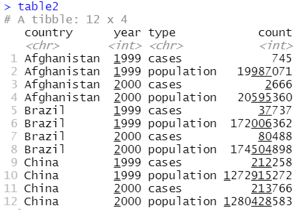

```{css, echo=FALSE}
pre {
  max-height: 300px;
  overflow-y: auto;
}

pre[class] {
  max-height: 150px;
}
```

```{r, echo=FALSE}
options(scipen = 999, digits = 4)
knitr::opts_chunk$set(message = FALSE, warning = FALSE)
```

## Contents

[Introduction to R and R Studio]()


# Introduction | R and RStudio
- https://github.com/uo-ec607/lectures

## Design of the R system
- R system is divided into 2 conceptual parts – 
    + The “base” R system that you download from CRAN https://cran.r-project.org/
    + Everything else.
- The “base” package contains the most fundamental functions used to run R.
- The other packages can be downloaded and installed as per user requirements; for eg.`AER` package is required for econometrics.

## R-console


## RStudio


## RStudio

- R Studio Integrated Development Environment (IDE) is a powerful and productive user interface for R.
- Like R, it is free and multi-platform. It can be downloaded from https://www.rstudio.com/
- RStudio is a separate open-source project that brings many powerful coding tools together into an intuitive, easy-to-learn interface.
- The RStudio program can be run on the desktop or through a web browser. 
- The desktop version is available for Windows, Mac OS X, and Linux platforms 


## Packages in R
- A package is a related set of functions, help files, and data files that have been bundled together. 
- For example, the `stats` package contains functions for doing statistical analysis. Some packages are included in R, other packages are available from public package repositories. You can also make your own packages!
- Visit the [CRAN webpage](https://cran.r-project.org/) for details on contributed packages.


## R Commands and Case Sensitivity
- Technically R is an 'expression language' and is case sensitive, so `A` and `a` are different symbols and would refer to different variables.
- Commands are separated either by a new-line or a semi colon (`;`). 
- Comments can be put almost anywhere starting with a `#`.
- If a command is not complete at the end of a line, R will give a different prompt, by default `+` on second and subsequent lines and continue to read input until the command is syntactically complete.


# The R-language | Basic Concepts


## The assignment operator 
- `<-` is called the assignment operator, read as 'gets'.
```{r}
# assign the value 1 to a.
# a gets the value 1
a <- 1
a
a <- 1 + 2
a
```


## Objects

- The entries that R creates and manipulates are known as 'objects' (more on this later).
- During an R session objects are created and stored by name.
- The R command `objects()` can be used to display the names of the objects that are currently stored within R.
- The collection of objects currently stored is called the 'workspace'.
- To remove objects the function `rm()` is available
```{r, eval=FALSE}
objects(); a <- 1+2; x
objects()
rm(x); objects()
```

## R has 5 basic/atomic classes of objects

- character: `"Hello"`
- numeric(real numbers/decimal numbers): `c(1,2.36)`.
- integer: `10L`
- complex :`2+4i`
- logical: `TRUE/FALSE`.

>- There are other *higher* classes of objects like the `vector`, `matrix`, `dataframe`, `list`, `tibble`, `lm` etc (we shall discuss them later). 


---

- `Inf` is a special number.
```{r}
1/Inf
Inf/Inf
```

- `NaN` (Not A Number) is a value that represents an undefined value `NaN` may represent missing values as well.


---

Objects in R have attributes like `names()`, `length()`, and `class()`, `dimnames()` (for a matrix, array or data frame).
```{r}
a1 <- 12; class(a1); length(a1)
names(a1) <- 'Number'; names(a1)

```

---


You can name an object in R almost anything you want, but there are a few rules.

- First, a name cannot start with a number. 
- Second, a name cannot use some special symbols,like `^`, `!`, `$`, `@`, `+`, `-`, `/`, or `*`.


## Working directory/ Projects
- To check the location of your working directory, use `getwd()`and to set a specific folder as your working directory use `setwd("file path")`. [Demo]
- Projects [Demo]


## The *pass-by-value* and *pass-by-reference* in R
By default, R uses "pass-by-value" paradigm. Consider the following example;
```{r, eval = FALSE}
x <- 1:10
x*2
x
# or consider
y <- x
x*3
y
```


## Coercion {.smaller}
1. Implicit Coercion
1. Explicit Coercion

Implicit Coercion occurs when we try to combine objects of two or more different classes. The ordering is roughly **LINCL** i.e `logical < integer < numeric < complex < character<list`.
```{r}
x <- c(1.7, "a"); class(x)
y <- c(TRUE, 2);class(y)
z <- c("a", TRUE);class(z)

```


## {.smaller}

We can explicitly coerce objects by using `as.*()` functions.
```{r}
x <- c(0,1,2,3,4,5,6)
class(x)
as.character(x)
as.complex(x)
as.logical(x)
```


---

Nonsensical coercion result in `NA`s. `NA` stands for Not Available.
```{r}
x <- c("my", "name ", "is", "khan!")
as.numeric(x)
as.complex(x)
as.logical(x)

```


## Your turn

- Create an integer vector that contains numbers 1 to 5 and assign it to `n`.
- Check the class of `n` and convert it to a character vector. Call it `n_c`.


## Operations on Matrices
Matrices are vectors with `dimension()` attribute.
```{r}
m <- matrix(1:10, nrow = 2, ncol = 5)
m
dim(m)
length(m)
class(m)
```


## Subsetting a matrix
Subsetting a matrix with `[` will subset objects of the same class
```{r, eval=FALSE}
x <- matrix(1:10, 2, 5); x
x[1,2]
x[2,5]
x[,2]
x[2,]
x[,1:3] # subset the first 3 columns of the matrix
x[,c(2,4)] # subset the second and fourth columns
x[1,c(2,4)] # subset the 1st row and second + fourth columns
diag(x) # this works only for a square matrix
t(x) # matrix transpose
```


## Your turn
- Create a 10X6 matrix with numbers between -30 and 30 (excluding 0). (Hint: Use vector subsetting.)
  - Extract the first and second elements from the fourth row. 
  - Extract the second and fifth elements from the second row

```{r, echo=FALSE, eval=FALSE}
matrix(c(-30:30)[-31], nrow = 10)
matrix(c(-30:30)[-31], nrow = 10)[4, 1:2]
matrix(c(-30:30)[-31], nrow = 10)[2, c(2,5)]
```


## Factors {.smaller}
- Factors represent categorical data.
- Factors can be ordered or unordered.
- Factors can be thought as integer vector with labels, like 1 means 'low', 2 means 'high', 3 means 'very high'.
- Example data set
```{r, echo=FALSE, warning=FALSE, message=FALSE}
library(tidyverse); library(kableExtra)
Names <- c("Kunal", "Ben", "Kritika", "Reena", "Narendra", "Smriti")
Gender <- factor(c("Male", "Male", "Female", "Female", "Male", "Female"))
Month.Birth <- factor(c("January", "March", "March", "December", "October", "October"))
kable(data.frame(Names, Gender, Month.Birth)) %>% kable_styling(bootstrap_options = c("striped", "hover"), full_width = FALSE, position = "center")
```


---

We can create factors using the information in the previous table:
```{r, eval=FALSE}
(Names <- c("Kunal", "Ben", "Kritika", "Reena", "Narendra", "Smriti"))
(Gender <- factor(c("Male", "Male", "Female", "Female", "Male", "Female")))
(Month.Birth <- factor(c("January", "March", "March", "December", "October", "October")))
(Month.Birth <- factor(c("January", "March", "March", "December", "October", "October"), levels = c("January", "March", "October", "December")))
```


## Extraction and subsetting {.smaller}

```{r, echo=FALSE, warning=FALSE, message=FALSE}
library(tidyverse); library(kableExtra)
Names <- c("Kunal", "Ben", "Kritika", "Reena", "Narendra", "Smriti")
Gender <- factor(c("Male", "Male", "Female", "Female", "Male", "Female"))
Month.Birth <- factor(c("January", "March", "March", "December", "October", "October"))
kable(data.frame(Names, Gender, Month.Birth)) %>% kable_styling(bootstrap_options = c("striped", "hover"), full_width = FALSE, position = "center")
```

- Which month was Smriti born in?
```{r}
Month.Birth[Names == "Smriti"]
```

## Extraction and subsetting {.smaller}

```{r, echo=FALSE, warning=FALSE, message=FALSE}
library(tidyverse); library(kableExtra)
Names <- c("Kunal", "Ben", "Kritika", "Reena", "Narendra", "Smriti")
Gender <- factor(c("Male", "Male", "Female", "Female", "Male", "Female"))
Month.Birth <- factor(c("January", "March", "March", "December", "October", "October"))
kable(data.frame(Names, Gender, Month.Birth)) %>% kable_styling(bootstrap_options = c("striped", "hover"), full_width = FALSE, position = "center")
```


- Which boy was born in March?
```{r}
Names[Gender == "Male" & Month.Birth == "March"]
```


## Releveling a factor
```{r}
(levels(Month.Birth) <- c(1, 3, 10, 12))
(levels(Gender) <- c(0, 1)) # 0 indicates female
```


## Defining and Ordering levels
- Performance ratings example

```{r}
m <- c("Poor", "Good", "Better")
rate <- factor(m)

(rate <- factor(m, ordered = TRUE,
                levels = m))

```

## Defining and Ordering levels
- LIKERT scale example

```{r}
s <- 1:5
rating <- factor(s)

(rating <- factor(s, ordered = TRUE,
                levels = s))

```


## Your turn {.smaller}

<style>
.divScroll {
overflow:scroll;
height:500px;
width:900px;
}
</style>

<div class="divScroll">
The Indian government consists of the political parties **BJP**, **INC**, **CPI**, **TMC** and other parties grouped under **Others** category. Suppose you asked 20 Indians which of these they identified most with and obtained the following data:

- There were 12 males and 8 females; the individuals numbered 1, 5-7, 12, and 14-16 were females.
- The individuals numbered 1,4,12,15,16 and 19 identified with *BJP*; no one identified with *CPI*, the individuals numbered 6,9 and 11 identified with *INC*, 10 and 20 identified with *Others*, and the rest with *TMC*.

a.Use your knowledge of vectors (for example, subsetting and overwriting) to create two character vectors: **sex** with entries "M" (male) and "F" (female) and **party** with entries "BJP", "INC", "CPI", "TMC", and "Others". Make sure the entries are placed in the correct positions as outlined earlier.
    
```{r, include=FALSE}
sex <- c(rep("M", times = 20))
sex[c(1, 5:7, 12, 14:16)] <- "F"
sex_fac <- as.factor(sex)

party <- c(rep("TMC", times = 20))
party[c(6,9, 11)] <- "INC"
party[c(10, 20)] <- "Others"
party[c(1,4,12,15,16, 19)] <- "BJP"
party_fac <- as.factor(party)
```

b.Create two different factor vectors based on **sex** and **party**. Does it make any sense to use `ordered=TRUE` in either case? How has R appeared to arrange the levels?
    
```{r, include=FALSE}
party1 <- factor(party, ordered = TRUE)
```
    
c.Use factor subsetting to do the following:
    i. Return the factor vector of chosen parties for only the male participants.
    ii. Return the factor vector of genders for those who chose BJP.
        
```{r, include=FALSE}
party_fac[sex_fac == "M"]
sex_fac[party_fac == "BJP"]
```
        
d.Another six people joined the survey, with the results **c("BJP","INC","INC","CPM","TMC","BJP")** for the preferred party and **c("M","M","F","F","F","M")** as their gender. Combine these results with the original factors from (b).
  
```{r, include=FALSE}
party0 <-  c("BJP","INC","INC","CPM","TMC","BJP")
sex0 <- c("M","M","F","F","F","M")

sex_fac_comb <- factor(c(sex, sex0))
party_fac_comb <- factor(c(party, party0))
```

</div>


## Data frames 

- Data frames are used to store tabular data.
- Data frames have an advantage over matrices in that they can store objects of different classes.

```{r}

mydata <- data.frame(Name =   c("Kunal", "Ben", "Kritika", "Reena", "Narendra", "Smriti"),
Gender = factor(c("M", "M", "F", "F", "M", "F"), levels = c("M", "F")),
Age = c(20, 18, 30, 24, 24, 27))
mydata
```

## {.smaller}

- Subsetting
```{r}
mydata$Name
mydata[,c("Name", "Age")]
mydata[,c(1,3)]
```


## Tibble
- Tibbles are data frames tweaked to work better in the `tidyverse`.
- It’s possible for a tibble to have column names that are not valid R variable names, aka non-syntactic names.
```{r}
tibble(
  `:)` = "smile", 
  ` ` = "space",
  `2000` = "number"
)
```


---

- Another way to create a tibble is with `tribble()`, short for t**r**ansposed tibble. 

```{r}
tribble(
  ~x, ~y, ~z,
  "a", 2, 3.6,
  "b", 1, 8.5
)
```

## Printing large datasets

<div style="float: left; width: 45%;">
```{r, message=FALSE, warning=FALSE}
library(AER); data("Journals")
Journals
```
</div>

<div style="float: right; width: 45%;">
```{r, message=FALSE, warning=FALSE}
as_tibble(Journals)
```
</div>


## Logical Operators

```{r, echo=FALSE, warning=FALSE, message=FALSE}
library(tidyverse); library(kableExtra)
c1 <- c("TRUE & TRUE = TRUE", "TRUE & FALSE = FALSE", "FALSE & TRUE = FALSE", "FALSE & FALSE = FALSE")
c2 <- c("TRUE | TRUE = TRUE", "TRUE | FALSE is TRUE", "FALSE | TRUE is TRUE", "FALSE | FALSE is FALSE")
c3 <- c("!TRUE = FALSE", "!FALSE = TRUE")

dt <- data.frame(Operator = c(rep("&",times = 4), "&&", rep("|",times = 4), "||", rep("!",times = 2)),
                 Interpretation = c(rep("AND (element-wise)",4), "AND (single comparison)", 
                                    rep("OR (element-wise)", 4), "OR (single comparison)", rep("NOT", 2)),
                 Results = c(c1, "same as above", c2, "same as above", c3))
knitr::kable(dt) %>%
    kable_styling(bootstrap_options = c("bordered"), position = "center", full_width = FALSE) %>%
    collapse_rows(columns = 1:2, valign = "middle")
```


---

Some examples
```{r}
a <- c(T,F,T,F); a
b <- c(F,T,T,T); b
a&b; a&&b
a|b; a||b
```

# <font color="black">Tidyverse | Reading and writing data </font> {data-background=workshop/tidyverse.PNG data-background-size=auto data-background-position=right}

---

- Create a csv file.
- `readr::read_csv()`: Reading comma delimited files [Demo]
- The first line of the data is used as column names.
- Skip metadata using `skip = n` argument.
- For data **without** column names, use `col_names = FALSE` to label $x_1$ to $x_n$ sequentially.
- You could also use a defined column name with `col_names = c('x', 'y', 'z')`.
- Represent missing values with `na = "."` or `na = " "`.

---

Reading other data formats

- `readxl::read_xlsx()` to import .xls and .xlsx.
- `haven::read_dta()` to import STATA files.
- `haven::read_spss()` to import .sav SPSS files.


Writing files

- `readr::write_csv()`
- `readr::write_excel_csv()`
- `haven::write_dta()`


# <font color="black">Tidyverse | `ggolot2` </font> {data-background=workshop/tidyverse.PNG data-background-size=auto data-background-position=right}


## {.smaller}
- Install the packages `install.packages(c("ggplot2", "gapminder"), dependencies = TRUE)` 
- Load the packages: 
```{r, warning=FALSE, message=FALSE}
library(gapminder); library(ggplot2)
data(package = 'gapminder')
data("gapminder")
gapminder #panel data on life expectancy, population size, and GDP per capita for 142 countries since the 1950s.
```


---

- Creating a ggplot
```{r}
ggplot(data = gapminder)+ 
  geom_point(mapping =  aes(x = gdpPercap, y = lifeExp))
```

---

```{r}
ggplot(data = gapminder, aes(log(gdpPercap), log(lifeExp)))+ # Global aesthetic mapping
  geom_point(mapping =  aes(col = continent, size = pop),
             alpha = 0.2)
```


---


```{r}
ggplot(data = filter(gapminder, year == 2002), aes((gdpPercap), (lifeExp)))+ # Global aesthetic mapping
  geom_point(aes(shape = continent),  alpha = 0.3)
```


## {.build}

```{r}
ggplot(data = filter(gapminder, year == 2002), aes((gdpPercap), (lifeExp)))+ # Global aesthetic mapping
  geom_point(aes(shape = continent),  alpha = 0.3)+
  geom_text(aes(label =if_else(gdpPercap > 30000 & lifeExp > 75, as.character(country), "")))
```


## {.build}

```{r}
library(ggrepel) # text labels repels away from each other
ggplot(data = filter(gapminder, year == 2002), aes((gdpPercap), (lifeExp)))+ # Global aesthetic mapping
  geom_point(aes(shape = continent),  alpha = 0.3)+
  geom_text_repel(aes(label =if_else(gdpPercap > 30000 & lifeExp > 75, as.character(country), "")), max.overlaps = 35)
```


---


```{r}
library(ggrepel) # text labels repels away from each other
ggplot(data = filter(gapminder, year == 2002), aes((gdpPercap), (lifeExp)))+ # Global aesthetic mapping
  geom_point(aes(shape = continent),  alpha = 0.3)+
  geom_label_repel(aes(label =if_else(gdpPercap > 30000 & lifeExp > 75, as.character(country), "")), max.overlaps = 35)
```


---

`nudge_x` and `nudge_y`

- Use the `nudge_x` and the `nudge_y` arguments to repel better.
- Both the arguments use their respective units on the x-axis and the y-axis.
- Try the previous example with the values of 
  - `nudge_x = ` -3000
  - `nudge_y = ` -15


---


```{r}
library(ggrepel) # text labels repels away from each other
ggplot(data = filter(gapminder, year == 2002), aes((gdpPercap), (lifeExp)))+ # Global aesthetic mapping
  geom_point(aes(shape = continent),  alpha = 0.3)+
  geom_text_repel(aes(label =if_else(gdpPercap > 40000 & lifeExp > 75, as.character(country), "")), max.overlaps = 35, nudge_x = 0.1, nudge_y = 0.1)+
  geom_point(aes(x = filter(gapminder, year == 2002, gdpPercap > 40000 & lifeExp > 75)$gdpPercap,y = filter(gapminder, year == 2002, gdpPercap > 40000 &lifeExp > 75)$lifeExp), col = "red")+
  geom_label_repel(aes(label =if_else(country == "India", as.character(country), "")), max.overlaps = 35, nudge_x = 0.1, nudge_y = 0.1)+
  geom_point(aes(x = filter(gapminder, year == 2002, country == "India")$gdpPercap,y = filter(gapminder, year == 2002, country == "India")$lifeExp), col = "red")
```


---


Facets (wrap)

```{r}
ggplot(gapminder) +
  geom_point(aes(log(gdpPercap), log(lifeExp)), alpha = 0.3)+
  facet_wrap(~ continent)
```


---


Facets (grid)

```{r}
ggplot(gapminder) +
  geom_point(aes(log(gdpPercap), log(lifeExp)), alpha = 0.3)+
  facet_grid(. ~ continent)
```


---


```{r}
ggplot(gapminder) +
  geom_point(aes(log(gdpPercap), log(lifeExp)), alpha = 0.3)+
  facet_grid(year ~ continent)
```


---


```{r}
ggplot(gapminder) +
  geom_point(aes(log(gdpPercap), log(lifeExp)), alpha = 0.3)+
  facet_grid(. ~ year)
```


## {.smaller}


```{r}
ggplot(filter(gapminder))+
  geom_bar(aes(continent), stat = "count") # the bars

```


---


```{r}
(Population <- filter(gapminder, year == 2007) %>% 
  group_by(continent) %>% 
  summarise(popu = round(sum(pop/1000000000),2)))
```


---


```{r}
Population %>% 
ggplot(aes(continent, popu))+
  geom_bar( stat = "identity") # the bars are the population figures w.r.t the continents
```


---


```{r}
# reorder() from base package
Population %>% 
ggplot(aes(reorder(continent, popu), popu))+
  geom_bar(stat = "identity") +
  labs(x = "Continent",
       y = "Population (in billions)")

```


---


```{r}
# reorder() from base package
Population %>% 
ggplot(aes(reorder(continent, -popu), popu))+
  geom_bar(stat = "identity") +
  labs(x = "Continent",
       y = "Population (in billions)")
```


---

```{r}
 Population %>% 
   ggplot(aes(reorder(continent, popu), popu))+
   geom_bar(stat = "identity")+
   geom_text(aes(label = popu))+
   expand_limits(y = c(0, 4.5)) +
   labs(x = "Continent", y = "Population (in billions)",
        title = "Population for 2007")
```


---

```{r}
 Population %>% 
   ggplot(aes(reorder(continent, popu), popu))+
   geom_bar(stat = "identity")+
   geom_text(aes(label = popu),
                   vjust = - 0.5)+
   expand_limits(y = c(0, 4.5)) +
   labs(x = "Continent", y = "Population (in billions)",
        title = "Population for 2007")
```


---

```{r}
(Population_prop <- Population %>% 
   mutate(propo = round(popu/sum(popu),3)))
```

---

```{r}
 Population_prop %>% 
   ggplot(aes(reorder(continent, propo),propo))+
  geom_bar(stat = "identity")+
  expand_limits(y = c(0,0.75))+
  geom_text(aes(label = propo), vjust = -0.5)+
   labs(x = "Continent", y = "Population (in %)",
        title = "Population for 2007")
```


---

We will do more plots later!


# <font color="black">Tidyverse | Data transformation </font> {data-background=workshop/tidyverse.PNG data-background-size=auto data-background-position=right}


---

**Packages and Data**

- `dplyr` package
  - `filter()`, `arrange()`, `select()`, `mutate()`, `summarise()` functions/verbs.
- `library(tidyverse)`
- `gapminder` data set


---


```{r, message=FALSE, warning=FALSE}
library(gapminder)
data(gapminder)
gapminder
```

---


**Filter rows with `filter()`**

- Filter all the countries in Asia for 1952.

*Note that `==` is used for comparison and `=` for assignment.* 
```{r}
filter(gapminder, continent == "Asia", year == 1952)
```

---

- Find all the countries in Asia or Africa.
```{r, eval=-1}
filter(gapminder, continent == "Asia" | continent == "Africa") 
# or
filter(gapminder, continent %in% c("Asia", "Africa"))
```
- `%in%` is used to see whether an object is contained within (i.e. matches one of) a list of items.

---

Find all the countries with per capita GDP between $\$500$ and $\$1000$.
```{r}
filter(gapminder, gdpPercap >= 500 & gdpPercap <= 1000 )
```


---

**Arrange rows with `arrange()`**

- Sorts a variable in ascending or descending order.
```{r}
arrange(gapminder, lifeExp)
```

---

```{r}
arrange(gapminder, desc(lifeExp))
```


---

**Select columns with `select()`**

- Select columns by name
```{r}
select(gapminder, year, pop, gdpPercap)
```


---


- `select(gapminder, year:gdpPercap)`
- `select(gapminder, -(year:gdpPercap))`
- `select(gapminder, starts_with("c"))`
- `select(gapminder, ends_with("p"))`
- `select(gapminder, contains("life"))`


 
---

`rename()` is a variant of `select()` that keeps all the variables that aren’t explicitly mentioned.
```{r}
rename(gapminder, perCapInc = gdpPercap)
```


---

**Add new variables with `mutate()`**

```{r}
mutate(gapminder, gdp = gdpPercap*pop)
```


---

Keep only required columns/variables with `transmute()`.
```{r}
transmute(gapminder, gdp = gdpPercap*pop)

```


## {.smaller}

**Combining multiple operations with the `%>%`**

```{r}
gapminder %>% 
  filter(country == "India")
```

Behind the scenes, `x %>% f(y)` turns into `f(x, y)`, and `x %>% f(y) %>% g(z)` turns into `g(f(x, y), z)` and so on. 

---

**Grouped summaries with `summarise()`**

- Find the mean life expectancy for India during 1952-2007.
```{r}
gapminder %>% 
  filter(country == "India") %>% 
  summarise(mean_lifeExp = mean(lifeExp))
```


---


- Compare the mean life expectancy of India and China during 1952-2007.
```{r}
gapminder %>% 
  filter(country %in% c("India", "China")) %>% 
  group_by(country) %>% 
  summarise(mean_lifeExp = mean(lifeExp))
```


---

**Some useful summary functions**

- Measures of location: `mean(x)`, `median(x)`
- Measures of spread: `sd(x)`, `IQR(x)`, `mad(x)`
- Measures of rank: `min(x)`, `quantile(x, 0.25)`, `max(x)`
- Measures of position: `first(x)`, `nth(x)`, `last(x)`
- Count: `n(x)`


# <font color="black">Tidyverse | Tidy data </font> {data-background=workshop/tidyverse.PNG data-background-size=auto data-background-position=right}

## {.smaller}

- Compute $rate = (cases / population)*100$ separately for `table1`, `table2`, `table3`, `table4a` and `table4b`


<div style="float: left; width: 45%;">


</div>

<div style="float: right; width: 45%;">


</div>


---

**Pivot Longer**


```{r, echo=FALSE, out.width= "100%" }
knitr::include_graphics("https://d33wubrfki0l68.cloudfront.net/3aea19108d39606bbe49981acda07696c0c7fcd8/2de65/images/tidy-9.png")
```


```{r, eval=FALSE}
table4a %>% 
  pivot_longer(c(`1999`, `2000`), names_to = "year", values_to = "cases")
```


---

**Pivot wider**


```{r, echo=FALSE, out.width= "80%" }
knitr::include_graphics("https://d33wubrfki0l68.cloudfront.net/8350f0dda414629b9d6c354f87acf5c5f722be43/bcb84/images/tidy-8.png")
```


```{r, eval=FALSE}
table2 %>% 
  pivot_wider(names_from = type, values_from = count)
```


## {.smaller}

**Separating**

```{r, echo=FALSE, out.width= "80%" }
knitr::include_graphics("https://d33wubrfki0l68.cloudfront.net/f6fca537e77896868fedcd85d9d01031930d76c9/637d9/images/tidy-17.png")
```

```{r, eval=FALSE, warning=FALSE}
table3 %>% 
  separate(col = rate, into = c("cases", "population"), sep = "/")
```


## {.smaller}


```{r, message=FALSE, warning=FALSE}
table3 %>% 
  separate(col = rate, into = c("cases", "population"), sep = "/")
```


```{r, message=FALSE, warning=FALSE}
table3 %>% 
  separate(col = rate, into = c("cases", "population"), sep = "/", convert = TRUE)
```

# Tidy NSSO data

## Understanding the data

- Unit Level Data of Periodic Labour Force Survey (PLFS), [July 2019-June 2020](http://mospi.nic.in/unit-level-data-periodic-labour-force-survey-plfs-july-2019-june-2020).
- Step 1: Read the layout.
  - PLFS Person Level Data of Re-Visit Schedule
  - File:  File: PER_RV.txt (PERSON LEVEL)   RECORD LENGTH: 275+1

- Step 2: Read the raw data.
- Step 3: Tidy the raw data.


---


```{r}
# read the layout
(`layout19-20` <- read_csv("C:/Users/Pravesh/Documents/blogdown/rworkshop/working/workshop/layout19-20.csv", skip = 171, n_max = 104) %>% 
  select(`Full Name`, `Item /Col.`,`Field Length`, `Byte Position`, X7) %>% 
   mutate(Name = paste(`Full Name`, `Item /Col.`, sep = '')) %>%  
  rename(Length = `Field Length`,
         Position1 = `Byte Position`,
         Position2 = X7))
```


---


```{r}
## read the raw data 
`perrv_19-20` <- read_csv("http://mospi.nic.in/sites/default/files/reports_and_publication/PLFS_2019_2020/PERRV.TXT", col_names = "raw") 


## tidy data
(`tidy_perrv_19-20` <- `perrv_19-20` %>% 
  separate(col = raw, into = `layout19-20`$Name,
           sep = cumsum(as.numeric(`layout19-20`$Length)),
           convert = TRUE))
```


# Simple Linear Regression


## Data

```{r, message=FALSE, warning=FALSE}
library(AER)
library(tidyverse)
data(Journals, package = "AER")
journals <- Journals %>% 
  mutate(citeprice = price/citations) %>% 
  select(subs, price, citeprice)
glimpse(journals)
```

## Summary

```{r}
library(summarytools)
dfSummary(journals, graph.col = FALSE ) 
```

## Regression model

- Estimate the effect of price per citation $citeprice$ on the number of subscriptions $subs$.
- Fit the following linear regression model
$$
\log(subs)_i = \beta_1 + \beta_2\log(citeprice)_i+ \epsilon_i
$$

## Plot {.smaller}
```{r}
library(ggplot2)
ggplot(data = journals, aes(log(subs), log(citeprice)))+
  geom_point() +
  geom_smooth(formula = y ~ x, method = "lm", se = FALSE) 
```


## Regression summary

```{r}
jour_lm <- lm(log(subs) ~ log(citeprice), data = journals)
summary(jour_lm)
```

## `lm` object
```{r}
class(jour_lm)
names(jour_lm)
jour_lm$coefficients
```


## Analysis of variance
```{r}
anova(jour_lm)
```

## Point and interval estimates

```{r}
# extract the estimated regression coefficients
coef(jour_lm)
```

```{r}
# calculate the confidence intervals
confint(jour_lm, level = 0.95)
```

## Testing a linear hypothesis {.smaller}

- Example: Test the hypothesis that the elasticity of number of subscriptions with respect to the price per citation equals $-0.5$, i.e. $H_0:\beta_2=-0.5$.

```{r}
library(car) # loads with AER
linearHypothesis(jour_lm, "log(citeprice) = -0.5")
```
- Cannot reject $H_0$.


# Multiple Linear Regression


## Data

```{r}
data(CPS1988, package = "AER")
# ?CPS1988
# summary(CPS1988)
dfSummary(CPS1988, graph.col = FALSE)

```


## Model
- The regression model we are interested is
$$
\log(wage) = \beta_1+ \beta_2experience+ \beta_3experience^2+ \\ \beta_4education+ \beta_5ethnicity + \epsilon
$$


---

```{r}
cps_lm <- lm(log(wage) ~ experience + I(experience^2) + education + ethnicity, data = CPS1988)
summary(cps_lm)
```


## Changing the reference category

```{r}
CPS1988$ethnicity <- relevel(CPS1988$ethnicity, ref = "afam")
summary(lm(log(wage) ~ experience + I(experience^2) + education + ethnicity, data = CPS1988))
```


## Comparison of models {.smaller}
- Is there any difference in the $\log(wage)$ (controlling for $experience$ and $education$) between Caucasian and African-American men?
- We already have a model `cps_lm` with all the variables including $ethnicity$.
- Now we need a model without $ethnicity$.
```{r}
noeth_lm <- update(cps_lm, formula =  . ~ . - ethnicity)
summary(noeth_lm)
```


## Comparison of models

```{r}
anova(cps_lm, noeth_lm )
```
The effect of $ethnicity$ is significant at any reasonable level.


## Interactions

```{r, echo=FALSE}
CPS1988$ethnicity <- relevel(CPS1988$ethnicity, ref = "cauc")
```


```{r}
cps_int <- lm(log(wage) ~ experience + I(experience^2) +
education * ethnicity, data = CPS1988)
# or cps_int <- lm(log(wage) ~ experience + I(experience^2) + education + ethnicity + education:ethnicity, data = CPS1988)
summary(cps_int)
```


## Separate regressions for each levels

```{r}
summary(
  update(cps_lm, formula = . ~ . - ethnicity, subset = ethnicity == "afam")
)
```


---


```{r}
summary(
  update(cps_lm, formula = . ~ . - ethnicity, subset = ethnicity == "cauc")
)
```

# Diagnostic tests

---

- The Breusch-Pagan test
```{r}
jour_lm <- lm(log(subs) ~ log(citeprice), data = journals)
# library(lmtest)
bptest(jour_lm)
bptest(cps_lm)
```

---

- The Goldfeld-Quandt test
```{r}
# library(lmtest)
gqtest(jour_lm, order.by = ~ citeprice, data = journals)

```


## Testing the functional form. {.smaller}

- Ramsey's RESET
- Misspecification of functional form (by omitting relevant variables).
- Let's assess whether second and third powers of $log(citeprice)$ can significantly improve the model. 
```{r}
# library(lmtest)
reset(jour_lm)
```

- The result is clearly non-significant, and hence no
misspecification can be detected in this direction.


# Multiple models in `stargazer` with heteroskedasticity-robust standard errors.


## Data {.smaller}
```{r}
library(AER)
library(tidyverse)
library(stargazer)

data(CASchools, package = "AER")
caschool <- CASchools

caschool <- mutate(caschool, str = students/teachers,
         testscr = (math + read)/2)
glimpse(caschool)
```


## {.smaller}

We shall consider the following models and graphically inspect the correlation and summarise all the regression results in a table.
$$
\begin{align*}
\text{(I)  }\text{testscr} &= \beta_0 + \beta_1\text{str} + u\\
\text{(II)  }\text{testscr} &= \beta_0 + \beta_1\text{str} + \beta_2\text{english} + u\\
\text{(III)  }\text{testscr} &= \beta_0 + \beta_1\text{str} + \beta_2\text{english} + \beta_3\text{lunch} + u\\
\text{(IV)  }\text{testscr} &= \beta_0 + \beta_1\text{str} + \beta_2\text{english} + \beta_3\text{calworks} + u\\
\text{(V)  }\text{testscr} &= \beta_0 + \beta_1\text{str} + \beta_2\text{english} + \beta_3\text{lunch} + \beta_4\text{calworks} + u\\
\end{align*}
$$

where, `testscr`- test score
`str` - student-teacher ratio
`english` - percentage of english learners
`lunch` - percentage of students that qualify for a free or subsidised lunch due to family incomes below a certain threshold.
`calworks` - percentage of students qualifying for the *calworks* income assistance programme.

## {.smaller}

```{r}
library(gridExtra)
p1 <- ggplot(caschool)+
  geom_point(aes(str, testscr)) +
  labs(title = "Test Scores and\nStudent teacher ratio")
p2 <- ggplot(caschool)+
  geom_point(aes(english, testscr)) +
  labs(title = "Test Scores and\nPercentage of english learners")
p3 <- ggplot(caschool)+
  geom_point(aes(lunch, testscr)) +
  labs(title = "Test Scores and\nPercentage of students qualifying\nfor free lunch")
p4 <- ggplot(caschool)+
  geom_point(aes(calworks, testscr))+
  labs(title = "Test Scores and\nPercentage of students qualifying \nfor income assistance programme")

grid.arrange(p1, p2, p3, p4, nrow = 2, ncol = 2, top = "Fig:1")

```


## {.smaller}

- Using colours

```{r}
caschool %>% 
  ggplot(aes(str, testscr))+
  geom_point(aes(colour = 'str'), alpha = 1)+
  geom_point(aes(x = english, colour = 'english'), alpha = 0.8) +
  geom_point(aes(x = lunch, colour = 'lunch'), alpha = 0.6)+
  geom_point(aes(x = calworks, colour = 'calworks'), alpha = 0.4) +
  labs(x = "",
       colour = "Variables",
       title = "Correlation")

```


## {.smaller}

-Using plotting characters (shapes)
```{r}
caschool %>% 
  ggplot(aes(str, testscr))+
  geom_point(aes(shape = 'str'), alpha = 0.5)+
  geom_point(aes(x = english, shape = 'english'), alpha = 0.5) +
  geom_point(aes(x = lunch, shape = 'lunch'), alpha = 0.5)+
  geom_point(aes(x = calworks, shape = 'calworks'), alpha = 0.5) +
  labs(x = "",
       shape = "Variables",
       title = "Correlation")

```


## {.smaller} 
- Non-linear model

```{r}
ggplot(caschool, aes(x = lunch, y = testscr))+
  geom_point()+
  geom_smooth(aes(colour = "linear"),formula = y ~ x, method = "lm", se =FALSE)+
  geom_smooth(aes(colour = "quadratic"),formula = y ~ x + I(x^2), method = "lm", se = FALSE)+
  labs(colour = "Models")
```


## Heteroskedasticity-robust standard errors.{.smaller}
Consistent estimation of $\sigma_{\hat\beta_1}$ under heteroskedasticity (**Eicker–Huber–White standard errors**):
$$
SE(\hat\beta_1) = \sqrt{\frac{1}{n}.\frac{\frac{1}{n}\sum_{i=1}^{n}(X_i - \overline{X})^2\hat{u_i}^2}{\Big[ \frac{1}{n}\sum_{i=1}^{n}(X_i - \overline{X})^2\Big]^2}}
$$

Degrees of freedom correction and considered by MacKinnon & White (1985), The difference is that we multiply by $\frac{1}{n-2}$ in the numerator of the previous equation.
$$
SE(\hat\beta_1)_{HC1} = \sqrt{\frac{1}{n}.\frac{\frac{1}{n-2}\sum_{i=1}^{n}(X_i - \overline{X})^2\hat{u_i}^2}{\Big[ \frac{1}{n}\sum_{i=1}^{n}(X_i - \overline{X})^2\Big]^2}}
$$


---

- variance-covariance heteroskedasticity-consistent matrix estimation using `vcovHC()` in the `sandwich` package.
```{r}
lm_model1 <- lm(testscr ~ str, data = caschool)
vcovHC(lm_model1, type = "HC1")
class(vcovHC(lm_model1, type = "HC1"))
```


---


- We are interested in the square root of the diagonal elements of this matrix, i.e., the standard error estimates.
```{r}
robust_se <- sqrt(diag(vcovHC(lm_model1, type = "HC1")
))
robust_se
```


## {.smaller}

```{r,  warning=FALSE}
# models
I <- lm(testscr ~ str, data = caschool)
II <- lm(testscr ~ str + english, data = caschool)
III <- lm(testscr ~ str + english + lunch, data = caschool)
IV <- lm(testscr ~ str + english + calworks, data = caschool)
V <- lm(testscr ~ str + english + lunch + calworks, data = caschool)

# gather all the robust standard error values in a list
robust_se1 <- list(
  sqrt(diag(sandwich::vcovHC(I, type = "HC1"))),
  sqrt(diag(sandwich::vcovHC(II, type = "HC1"))),
  sqrt(diag(sandwich::vcovHC(III, type = "HC1"))),
  sqrt(diag(sandwich::vcovHC(IV, type = "HC1"))),
  sqrt(diag(sandwich::vcovHC(V, type = "HC1")))
)

## use the `stargazer()` function to represent the output in a tabular form
stargazer::stargazer(I, II, III, IV, V, type = "text", 
                     title = "Analysis of caschool dataset.",
                     se = robust_se1, digits = 3, 
                     column.labels = c("I", "II", "III", "IV", "V"),
                     column.sep.width = "1pt",
                     notes = "Heteroskedasticity robust standard errors are given in parentheses under coefficients.", 
                     notes.append = TRUE) 
```
